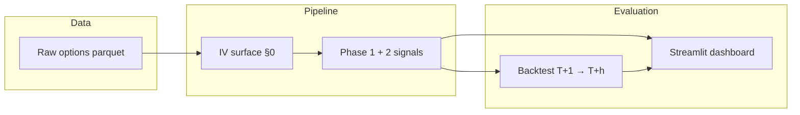

# Options-Implied Equity Signals

[](https://github.com/arJ-V/Options-implied-equity/actions/workflows/ci.yml)

**Options prices are not just bets on direction — they encode a rich picture of how the market prices risk.** This project extracts that information into cross-sectional equity return signals, tests whether those signals predict future returns, and visualizes the results.

View the live dashboard demo [here](https://options-implied-equity-7ypdbpfkgrkgxhb8irqxyb.streamlit.app/).

| | |
|---|---|
| **Universe (starter)** | SPY, QQQ, IWM |
| **History** | 2008–2025 (release data) |
| **Signals** | Smirk, risk reversal, put-call spread, term slope, VRP, BKM implied skew |
| **Stack** | Python · pandas · Streamlit · Plotly |

**Spec:** [`instructions.md`](instructions.md) (formula definitions) · **Parameters:** [`config.yaml`](config.yaml) (pinned research choices)

---

## The core idea

Equity options sit at the intersection of two worlds:

1. **The physical world** — what actually happens to the stock (realized returns, realized volatility).
2. **The risk-neutral world** — what the option market *implies* will happen, after adjusting for risk premia and investor preferences.

When these two worlds diverge in systematic ways, that divergence can predict future stock returns. The literature documents several such patterns:

- **Skew and smirk** — investors pay up for downside protection; a steep put wing often reflects crash anxiety or informed bearish positioning.
- **Put–call parity deviations** — when call IV systematically exceeds put IV at the same strike (or vice versa), it can reflect directional demand imbalances not yet reflected in the spot price ([Cremers & Weinbaum, 2010](https://doi.org/10.1093/rfs/hhp057)).
- **Term structure** — an inverted vol curve (front month > back month) often signals near-term event risk or stress.
- **Variance risk premium** — implied vol tends to exceed realized vol on average; the *gap* varies cross-sectionally and may forecast returns.
- **Implied higher moments** — the full shape of the risk-neutral distribution, not just its variance, carries information about tail risk and future performance ([Bakshi, Kapadia & Madan, 2003](https://doi.org/10.1111/1540-6261.00549); [Conrad, Dittmar & Ghysels, 2013](https://doi.org/10.1093/rfs/hhs081)).

This repo implements these ideas as a reproducible research pipeline: standardize the volatility surface, compute signals, backtest cross-sectionally, and explore interactively.

---

## The volatility surface

Before any signal is computed, raw option chains are unusable. Strikes and expiries differ every day; quotes are noisy; illiquid wings are unreliable.

The first step is to build a **standardized implied-volatility surface** — a fixed grid of deltas and maturities for every `(date, underlying)`:

| Grid axis | Points |
|-----------|--------|
| **Deltas** | Put: −10, −25, −50 · Call: +10, +25, +50 |
| **Maturities** | 30, 60, 90 calendar days |

Interpolation happens in two stages: across strikes within each expiry, then across time in **total variance** (IV² × T), not raw IV. Interpolating raw IV across maturities is a common subtle error — total variance is the quantity that should be linear in time under no-arbitrage.

The surface is the shared input to every signal below. See [`instructions.md` §0](instructions.md) and [`signals/surface.py`](signals/surface.py) for filters and implementation details.

---

## Signals: theory and intuition

Each signal is one number per `(date, underlying)`. The table summarizes economics; subsections go deeper.

| Signal | What it measures | Literature | Typical prediction |
|--------|-----------------|------------|-------------------|
| **Smirk** | Steepness of the put wing vs ATM | [Xing, Zhang & Zhao, 2010](https://doi.org/10.1287/mnsc.1090.1225) | High smirk → lower future returns |
| **Risk reversal** | Call-rich vs put-rich at 25Δ | Practitioner / skew trading | Rising RR (less negative) → bullish tilt |
| **Put–call spread** | Parity deviation across matched strikes | [Cremers & Weinbaum, 2010](https://doi.org/10.1093/rfs/hhp057) | Calls richer → positive returns |
| **Term slope** | Near vs far ATM vol | Event-risk / stress literature | Inversion → bearish near-term |
| **VRP** | Implied vol minus trailing realized vol | [Carr & Wu, 2009](https://doi.org/10.1093/rfs/hhn167) | Direction empirical; gap varies by name |
| **Implied skew (BKM)** | Risk-neutral skewness from OTM strip | [BKM, 2003](https://doi.org/10.1111/1540-6261.00549); [CDG, 2013](https://doi.org/10.1093/rfs/hhs081) | More negative skew → higher returns |

### Smirk (volatility skew)

Equity index and single-stock options almost always exhibit a **volatility smirk**: out-of-the-money puts trade at higher implied vol than at-the-money calls. Economically, this reflects:

- **Crash insurance demand** — investors pay a premium for downside protection, especially after events like 1987 or 2008.
- **Leverage effect** — as prices fall, effective leverage rises, amplifying volatility; the risk-neutral density prices this asymmetry.
- **Informed trading** — informed bearish traders may prefer puts, bidding up put IV relative to calls.

**Signal:** `smirk = iv_p25_30 − iv_atm_30` (25-delta put IV minus ATM IV at 30 days).

**Prediction:** Names with unusually steep smirks tend to underperform — the market may already be pricing in bad news, or the skew reflects overpriced crash insurance that mean-reverts. Go **short** high-smirk names in a cross-sectional portfolio.

### Risk reversal

A **risk reversal** compares IV on the call wing vs the put wing at the same delta magnitude (here, 25Δ):

**Signal:** `risk_reversal = iv_c25 − iv_p25`

For equities, this is typically **negative** (puts are richer). A *rising* risk reversal — moving toward zero or positive — means calls are gaining ground relative to puts, a bullish repositioning in the wings. Go **long** names with relatively high (less negative) risk reversals.

The normalized variant `RR / iv_atm` makes the signal comparable across names with different absolute vol levels.

### Put–call IV spread (Cremers–Weinbaum)

Put–call parity links call and put prices at the same strike and expiry. In frictionless markets, they should imply the same volatility. In practice, **call IV and put IV diverge** when directional demand hits one side of the pair harder.

**Signal:** Open-interest-weighted average of `(IV_call − IV_put)` over all valid same-(strike, expiry) pairs.

**Prediction:** When calls are systematically richer than puts (`VS > 0`), the options market is tilting bullish in a way not fully reflected in the stock — future returns tend to be positive. This is one of the more robust cross-sectional patterns in the literature. Go **long** high-VS names.

> **Important:** This signal uses *raw paired quotes*, not interpolated surface points. Feeding it delta-grid IVs would break the parity logic.

### Term-structure slope

The **term structure of ATM implied vol** describes how uncertainty is priced across horizons.

**Signal:** `term_slope = iv_atm_90 − iv_atm_30`

- **Normal (upward) slope** — far-dated vol exceeds near-dated vol; typical in calm markets.
- **Inverted (backwardated) slope** — near-term vol exceeds far-dated vol; often associated with imminent event risk (earnings, macro shocks, distress).

**Prediction:** Inversion tends to be bearish for near-term returns — the market is paying disproportionately for short-dated protection. This signal is masked within 30 days of earnings for single names (earnings artificially inflate front-month vol).

### Variance risk premium (VRP)

On average, **implied volatility exceeds realized volatility** — sellers of options earn a premium for bearing volatility risk. But the *size* of that gap varies across stocks and over time.

**Signal:** `vrp = iv_atm_30 − RV_21`, where `RV_21` is annualized realized vol from the trailing 21 trading days of log returns.

**Economics:** A large positive VRP means the market is pricing more uncertainty than recent history warrants. Whether that predicts positive returns (selling vol was too aggressive) or negative returns (the market sees something history hasn't yet) is **empirical** — do not assume the sign. The backtest determines orientation.

### Implied skewness (BKM / CDG)

Skew-based signals above capture *local* wing steepness. **Model-free implied skewness** extracts the third moment of the entire risk-neutral distribution from a strip of OTM options ([Bakshi, Kapadia & Madan, 2003](https://doi.org/10.1111/1540-6261.00549)).

**Signal:** Numerical integration over OTM calls and puts at a fixed maturity, following the BKM strike-strip formulas (see [`instructions.md` §6](instructions.md)).

**Prediction:** [Conrad, Dittmar & Ghysels (2013)](https://doi.org/10.1093/rfs/hhs081) find that more **negative** implied skewness predicts **higher** subsequent returns — the market overprices left-tail risk relative to what materializes. Go **long** names with more negative implied skew.

> This is the most data-hungry signal: it needs a dense, wide strike strip. Results are sensitive to integration grid and OTM wing coverage.

### Order flow (planned — Phase 3)

[Pan & Poteshman (2006)](https://doi.org/10.1287/mnsc.1050.0225) show that **buyer-initiated opening volume** in options predicts stock returns — informed traders often express views in options before spot. This requires signed/opening volume data (e.g. IvyDB) not available in standard EOD chains. Planned but not yet implemented.

---

## How signals are evaluated

Signals are tested as **cross-sectional predictors** of forward equity returns:

1. **Signal at close on day T** — uses only data observable by that close (no lookahead).
2. **Forward return** — log return from **T+1** open/close to **T+h** (default *h* = 21 trading days ≈ one month).
3. **Cross-sectional rank IC** — each day, rank names by signal and by forward return; compute Spearman correlation. Positive IC means the signal ranks winners above losers.
4. **Long–short spread** — go long the top quintile and short the bottom quintile by oriented signal; track cumulative spread return.

**Orientation** flips signal sign where needed so that "long top quintile" is always the hypothesized direction (see [`signals/constants.py`](signals/constants.py)):

| Signal | Oriented long when… |
|--------|---------------------|
| Smirk | Low (inverted: high smirk → short) |
| Risk reversal | High (less negative / positive) |
| Put–call spread | High (calls richer) |
| Term slope | High (but interpret inversion carefully) |
| VRP | Empirical |
| Implied skew | Low raw value (more negative → long) |

With only three ETFs in the starter universe, cross-sectional statistics are **illustrative, not statistically powerful**. The pipeline is designed for a 100+ name panel where quintile spreads and daily IC become meaningful.

---

## What to expect in the starter backtest

On SPY / QQQ / IWM (2020–2024, 21-day horizon), the stronger patterns in-sample are:

- **Put–call spread** — among the most consistent; aligns with Cremers–Weinbaum.
- **Term slope** and **VRP** — reasonable IC; interpret cautiously with *n* = 3.
- **Smirk** and **risk reversal** — weak with three highly correlated ETFs; need a broad single-name panel.

These results are a **sanity check** that the pipeline reproduces known directions, not a strategy recommendation.

---

## Caveats

- **Correlation across ETFs** — SPY, QQQ, IWM move together; cross-sectional tests need diverse names.
- **Transaction costs** — options-implied signals are slow-moving; turnover depends on rebalance frequency, but shorting and options microstructure matter in production.
- **Surface construction choices** — delta grid, maturity pair, quote filters, and interpolation method all affect signals. Everything is pinned in [`config.yaml`](config.yaml) but remains a research choice.
- **Earnings contamination** — front-month vol spikes around earnings distort term slope; the pipeline flags and masks these for single names.
- **Data coverage** — BKM skew needs wide OTM wings; thinly quoted names will return NaN.
- **In-sample only** — no walk-forward or out-of-sample split is enforced; treat all ICs as exploratory.

---

## What the pipeline does (technical)



1. **Standardize** raw quotes into the delta × maturity IV surface.
2. **Compute** one signal per `(date, underlying)`.
3. **Backtest** with leakage-safe forward returns.
4. **Visualize** in the Streamlit dashboard (local or [cloud demo](https://options-implied-equity-7ypdbpfkgrkgxhb8irqxyb.streamlit.app/)).

---

## Quick start

**Requirements:** Python 3.11+, ~1.5 GB disk for starter data.

```bash
git clone https://github.com/arJ-V/Options-implied-equity.git
cd Options-implied-equity

make install      # venv + pip install
make data         # download SPY/QQQ/IWM parquet (~1.3 GB)
make signals      # write data/processed/signals.parquet
make backtest     # IC + long-short outputs
make dashboard    # http://localhost:8501
```

<details>
<summary>Manual setup (without Make)</summary>

```bash
python3 -m venv .venv && source .venv/bin/activate
pip install -r requirements.txt

./scripts/download_release.sh
python run_signals.py --start 2020-01-01 --end 2024-12-31
python run_backtest.py --horizon 21
streamlit run app/dashboard.py
```

</details>

The dashboard works immediately with the bundled [`data/sample/signals.parquet`](data/sample/signals.parquet) (2024 demo) if you skip the download step.

---

## Repository layout

```
Options-implied-equity/
├── signals/              # Surface builder + signal modules
├── backtest/             # Forward returns, IC, long-short
├── app/dashboard.py      # Streamlit + Plotly UI
├── scripts/              # Data download helpers
├── data/
│   ├── raw/release/      # Input parquet (gitignored)
│   ├── processed/        # signals + backtest outputs (gitignored)
│   └── sample/           # Committed demo panel for cloud deploy
├── config.yaml           # Pinned thresholds, deltas, horizons
├── instructions.md       # Full signal specification
├── run_signals.py        # Signal pipeline CLI
├── run_backtest.py       # Backtest CLI
└── paths.py              # Shared path constants
```

---

## Data

| Source | Status | Notes |
|--------|--------|-------|
| [Lambda Class release](https://github.com/lambdaclass/options_portfolio_backtester/releases/tag/data-v1) | **Working** | SPY, QQQ, IWM options + underlying, 2008–2025 |
| Dubach CDN (`static.philippdubach.com`) | Offline (404) | 104-ticker panel — `scripts/download_all.sh` probes and fails fast |
| yfinance | Fallback | Live chains only; no reliable historical panel |

```bash
./scripts/download_release.sh
python scripts/fetch_data.py --symbols SPY QQQ IWM
```

---

## CLI reference

```bash
python run_signals.py --symbols SPY QQQ IWM --start 2020-01-01 --end 2024-12-31
python run_backtest.py --signals data/processed/signals.parquet --horizon 21
make test   # or: pytest -q
```

---

## Deployment

### Docker

```bash
docker compose up --build
```

### Streamlit Community Cloud

1. Push this repo to GitHub (includes `data/sample/signals.parquet`).
2. [share.streamlit.io](https://share.streamlit.io) → **Create app** → `app/dashboard.py`
3. Python 3.11+; deps from root `requirements.txt`

### Scheduled refresh

[`.github/workflows/refresh-data.yml`](.github/workflows/refresh-data.yml) runs weekly: downloads starter data, recomputes signals + backtest, uploads artifacts.

---

## Roadmap

- [x] Phase 1 signals + pipeline + backtest
- [x] Streamlit dashboard + Docker + CI
- [x] BKM implied skew (Phase 2)
- [x] Earnings mask for term slope
- [x] Multi-source data loader
- [ ] Order flow signals (Phase 3 — needs signed/opening volume)
- [ ] 104-ticker panel when Dubach CDN returns (or ThetaData EOD)

---

## References

- Bakshi, Kapadia & Madan (2003) — model-free implied volatility and skewness
- Carr & Wu (2009) — variance risk premium
- Conrad, Dittmar & Ghysels (2013) — implied skewness and the cross-section of returns
- Cremers & Weinbaum (2010) — put–call parity deviations
- Pan & Poteshman (2006) — option order flow and stock returns
- Xing, Zhang & Zhao (2010) — smirk and expected returns

---

## License

MIT — see [LICENSE](LICENSE).
