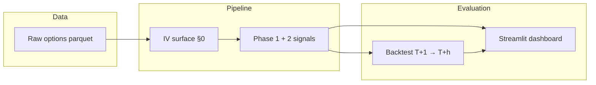

# Options-Implied Equity Signals

[](https://github.com/arJ-V/Options-implied-equity/actions/workflows/ci.yml)

Research pipeline that turns historical options chains into cross-sectional equity return signals, evaluates them with a leakage-safe backtest, and explores results in an interactive dashboard.

View app demo [here](https://options-implied-equity-7ypdbpfkgrkgxhb8irqxyb.streamlit.app/)

| | |
|---|---|
| **Universe (starter)** | SPY, QQQ, IWM |
| **History** | 2008–2025 (release data) |
| **Signals** | Smirk, risk reversal, put-call spread, term slope, VRP, BKM implied skew |
| **Stack** | Python · pandas · Streamlit · Plotly |

**Spec:** [`instructions.md`](instructions.md) (formula definitions) · **Parameters:** [`config.yaml`](config.yaml) (pinned research choices)

---

## What it does



1. **Standardize** raw quotes into a fixed delta × maturity IV surface (total-variance interpolation).
2. **Compute** one signal value per `(date, underlying)` — see [Signals](#signals).
3. **Backtest** with forward log returns from **T+1** to **T+h** (no same-day leakage).
4. **Visualize** signal time series, cross-sectional IC, rolling IC, and long-short spreads.

---

## Quick start

**Requirements:** Python 3.11+, ~1.5 GB disk for starter data.

```bash
git clone https://github.com/arJ-V/Options-implied-equity.git
cd Options-implied-equity

make install      # venv + pip install
make data         # download SPY/QQQ/IWM parquet (~1.3 GB)
make signals      # write data/processed/signals.parquet
make backtest     # IC + long-short outputs
make dashboard    # http://localhost:8501
```

<details>
<summary>Manual setup (without Make)</summary>

```bash
python3 -m venv .venv && source .venv/bin/activate
pip install -r requirements.txt

./scripts/download_release.sh
python run_signals.py --start 2020-01-01 --end 2024-12-31
python run_backtest.py --horizon 21
streamlit run app/dashboard.py
```

</details>

The dashboard works immediately with the bundled [`data/sample/signals.parquet`](data/sample/signals.parquet) (2024 demo) if you skip the download step.

---

## Repository layout

```
Options-implied-equity/
├── signals/              # Surface builder + signal modules
│   ├── surface.py        # §0 standardized IV grid
│   ├── smirk.py          # Phase 1 signals
│   ├── implied_skew.py   # Phase 2 BKM strike-strip integrals
│   ├── pipeline.py       # Orchestration (parallel per symbol)
│   └── data_sources.py   # Release → CDN → yfinance fallback
├── backtest/             # Forward returns, IC, long-short
├── app/dashboard.py      # Streamlit + Plotly UI
├── scripts/
│   ├── download_release.sh   # Starter data (works today)
│   ├── download_all.sh         # 104-ticker Dubach CDN (offline)
│   └── fetch_data.py           # Python data fetch CLI
├── data/
│   ├── raw/release/      # Input parquet (gitignored)
│   ├── processed/        # signals + backtest outputs (gitignored)
│   └── sample/           # Committed demo panel for cloud deploy
├── config.yaml           # Pinned thresholds, deltas, horizons
├── instructions.md       # Full signal specification
├── run_signals.py        # Signal pipeline CLI
├── run_backtest.py       # Backtest CLI
└── paths.py              # Shared path constants
```

---

## Configuration

All research choices live in [`config.yaml`](config.yaml): quote filters, delta grid `{±10, ±25, ±50}`, maturities `{30, 60, 90}` days, RV window, earnings mask window, BKM strike grid, and backtest horizons.

Signal formulas and expected directions are documented in [`instructions.md`](instructions.md). Implementation orientation for the backtest is in [`signals/constants.py`](signals/constants.py).

---

## Signals

| Signal | Formula (summary) | Expected direction |
|--------|-------------------|-------------------|
| **Smirk** | `iv_p25_30 − iv_atm_30` | high → short |
| **Risk reversal** | `iv_c25 − iv_p25` | high → long |
| **Put-call spread** | OI-weighted `IV_call − IV_put` | high → long |
| **Term slope** | `iv_atm_90 − iv_atm_30` | inversion → bearish |
| **VRP** | `iv_atm_30 − RV_21` | empirical |
| **Implied skew (BKM)** | OTM strike-strip integrals | more negative → long |

Term slope is masked within 30 days of earnings when single-name calendars are available (no-op for ETFs).

---

## Data

| Source | Status | Notes |
|--------|--------|-------|
| [Lambda Class release](https://github.com/lambdaclass/options_portfolio_backtester/releases/tag/data-v1) | **Working** | SPY, QQQ, IWM options + underlying, 2008–2025 |
| Dubach CDN (`static.philippdubach.com`) | Offline (404) | 104-ticker panel — `scripts/download_all.sh` probes and fails fast |
| yfinance | Fallback | Live chains only; no reliable historical panel |

```bash
# Preferred: shell download
./scripts/download_release.sh

# Or Python fetcher (release → CDN → yfinance)
python scripts/fetch_data.py --symbols SPY QQQ IWM
```

**What’s in git:** `data/sample/signals.parquet` only (~155 KB). Raw and processed outputs are [gitignored](.gitignore).

---

## CLI reference

```bash
# Signals
python run_signals.py --symbols SPY QQQ IWM --start 2020-01-01 --end 2024-12-31
python run_signals.py --output data/sample/signals.parquet   # regenerate demo file

# Backtest
python run_backtest.py --signals data/processed/signals.parquet --horizon 21

# Tests
make test   # or: pytest -q
```

Backtest writes `backtest_summary.parquet`, `backtest_ic.parquet`, `backtest_ls.parquet`, and `backtest_rolling_ic.parquet` under `data/processed/`.

---

## Deployment

### Docker

```bash
docker compose up --build
```

Mounts `data/processed` and `data/raw/release` read-only (see [`docker-compose.yml`](docker-compose.yml)).

### Streamlit Community Cloud

1. Push this repo to GitHub (includes `data/sample/signals.parquet`).
2. [share.streamlit.io](https://share.streamlit.io) → **Create app**
3. **Main file path:** `app/dashboard.py`
4. **Python:** 3.11 or 3.12 — dependencies load from root `requirements.txt`
5. Optional **Secrets** ([`.streamlit/secrets.toml.example`](.streamlit/secrets.toml.example)):

```toml
[data]
signals_path = "data/sample/signals.parquet"
```

The app prefers `data/processed/signals.parquet` when present, otherwise falls back to the bundled sample.

### Scheduled refresh

[`.github/workflows/refresh-data.yml`](.github/workflows/refresh-data.yml) runs weekly (or on demand): downloads starter data, recomputes signals + backtest, uploads artifacts.

---

## Roadmap

- [x] Phase 1 signals + pipeline + backtest
- [x] Streamlit dashboard + Docker + CI
- [x] BKM implied skew (Phase 2)
- [x] Earnings mask for term slope
- [x] Multi-source data loader
- [ ] Order flow signals (Phase 3 — needs signed/opening volume)
- [ ] 104-ticker panel when Dubach CDN returns (or ThetaData EOD)

---

## License

MIT — see repository for details.
